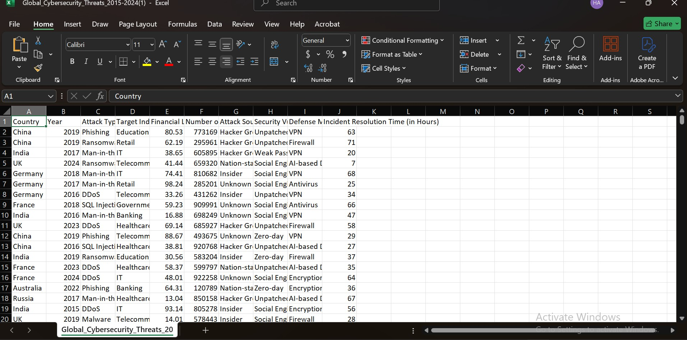
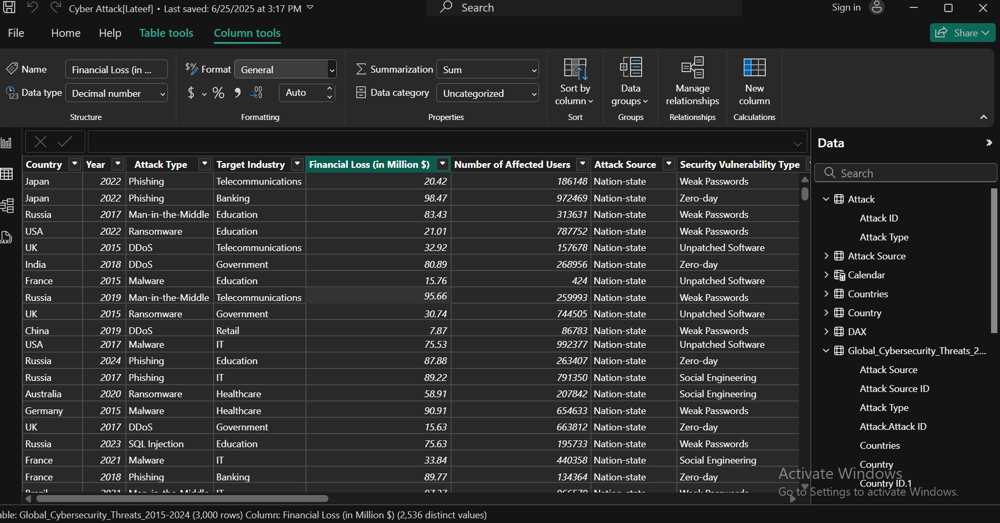
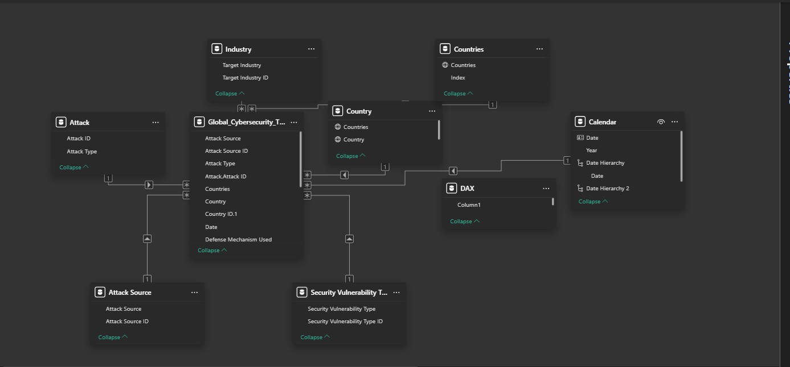
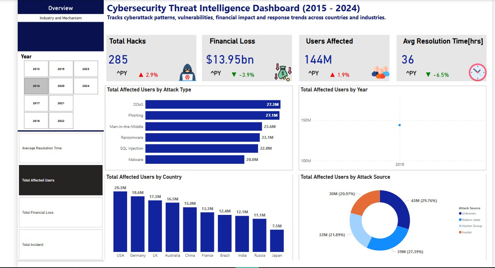
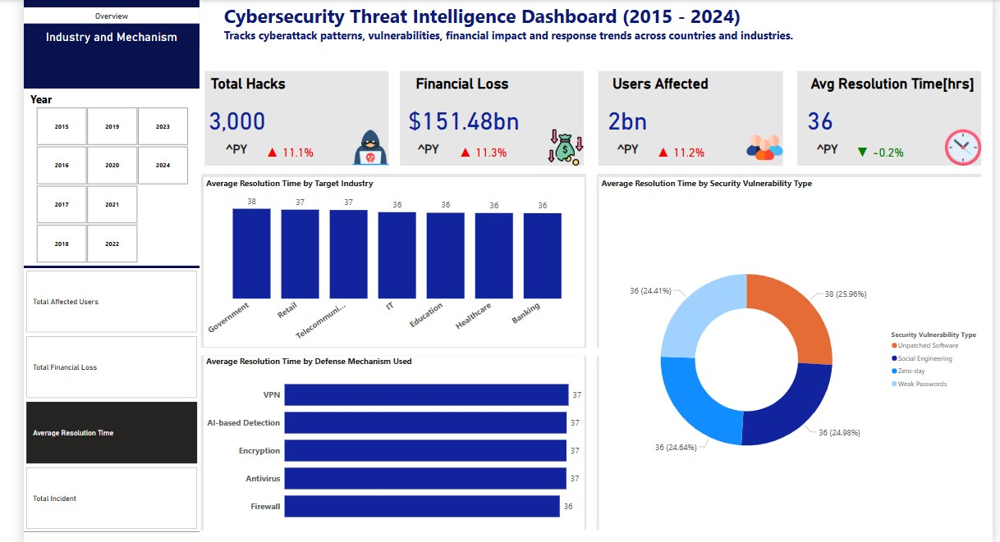

# Cybersecurity-Threat-Intelligence Analysis

# Introduction : Project Overview

## Title:Global Cybersecurity Threats Analysis (2015–2024)
This is a power BI project on threat analysis sourced from **Kaggle**.
This report analyzes 3,000 cybersecurity incidents recorded between 2015-2024 across 10 countries, sourced from Kaggle's cybersecurity dataset. Key findings reveal $151 billion in financial losses, 2 billion users affected, and an average 36-hour resolution time for security incidents. The UK, Germany, and Brazil emerged as the most impacted nations, while DDoS, phishing, and zero-day exploits were the most damaging attack vectors.

Dataset: Contains cyberattack records across countries, industries, and attack types, including fields like:
-  Year, Country, Industry, Attack Type,
-  Financial Loss ($M), Users Affected, Resolution Time, Vulnerability Type

# Project Goal
The goal of this analysis is to assess the global impact of cybersecurity threats between 2015 and 2024 by examining attack trends, financial losses, affected industries, and geographical hotspots. Using Kaggle’s cybersecurity dataset, this project aims to:

-  Quantify the economic and operational damage caused by cyberattacks
-  Identify the most prevalent attack methods and exploited vulnerabilities
-  Highlight high-risk industries and regions
-  Provide actionable insights to improve organizational cybersecurity strategies

#  Methodology
This project followed a structured data-driven approach to analyze global cybersecurity threats from 2015–2024. The methodology consisted of four key phases:

1. Data Collection & Sourcing
2. Data Cleaning & Preprocessing
3. Data Analysis
4. Reporting & Visualization

# Data Visualization

Below are screenshots of data in MS Excel and Power BI during data modelling and analysis

To interact with this visual, [CLICK HERE](https://app.powerbi.com/groups/me/reports/a8ffdf04-4321-4edb-a989-ab2786781005/b244115d95e46990e36e?experience=power-bi)

Data in Excel                        | Data in Power BI                     | Data Modelling
:-----------------------------------:| :-----------------------------------:| :-----------------------------------:
                       |                     |    

Dashboards:
Overview                             | Industry and Defense Mechanism             
:-----------------------------------:| :-----------------------------------:
                  |                   

